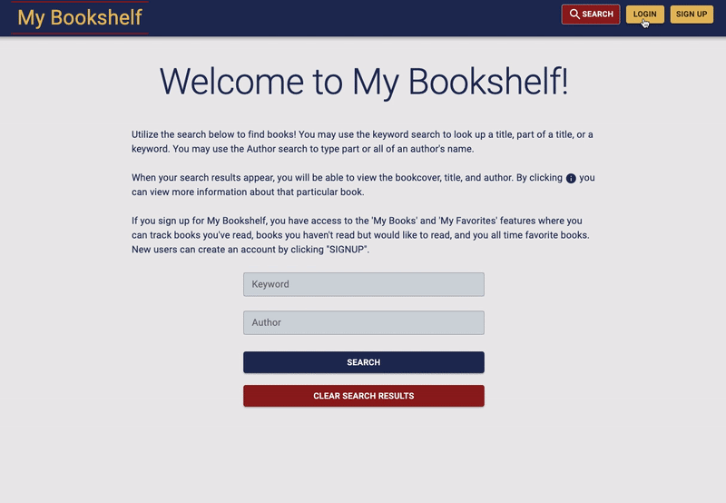
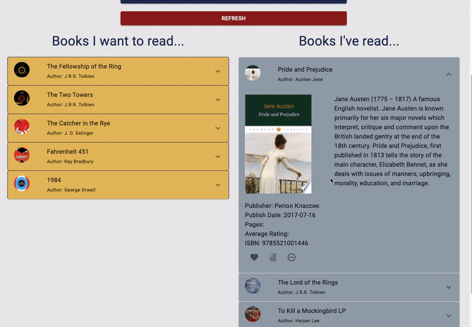

# My Bookshelf

## Description
This is a full stack application using Google Books API and a MySQL database that allows the user to search for books by author or keyword/title.  Users can also create an account all CRUD operations are used to allow users to save books, mark them as 'read' or 'unread', favorite books, and remove books from their account.  On their "My Books" page, they can view any books they have saved and can also filter those books by author.

## Link and demo login
This app is deployed on Heroku:  [https://intense-eyrie-62668.herokuapp.com/](https://intense-eyrie-62668.herokuapp.com/)
Use the following email and password as a demo login:
 
email:  `demo@email.com`
 
password: `password`

## Technologies used
* React
* MySQL
* Node
* Express
* Axios
* Sequelize
* Google Books API
* Material ui
* Passport
* create-react-app
* Heroku

## Demonstrations

### Login and search: 

### My Books and favorites: 

## Created by:
Kaleigh Spurio